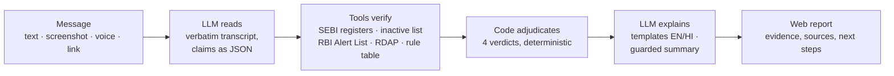

# Jaanch · जाँच

**Paste it. Jaanch investigates it.**

Jaanch is a website that checks the claims in an investment message (pasted text, chat
screenshots, a link or a voice note) against India's official records before you send money.
Every claim gets a verdict backed by evidence you can open on the regulator's own website. In
English and Hindi.

> Jaanch does not give investment advice, and never rates anything "safe" or "scam".

---

## The problem

Investment pitches on WhatsApp, Telegram and SMS borrow credibility: a **real SEBI registration
number that belongs to someone else**, "SEBI approved" tips, guaranteed returns, "institutional
accounts", a personal UPI ID, an APK link, "offer valid today only". Checking them needs knowledge
of SEBI's registers and rules that most retail investors don't have.

## What Jaanch does

- Lists every claim in the message, word for word.
- Checks each against **SEBI's registers** (12 categories, refreshed daily and confirmed live),
  **SEBI's list of cancelled/suspended registrations**, **SEBI's rules** (cited to the circular and
  clause), **RBI's Alert List** and **domain records**.
- Decides each claim with fixed rules: **CONTRADICTED · MATCHES · NOT FOUND · CAN'T CHECK**.
- Shows _who is contacting you_ next to _who is registered_: name, number, phone, email, website.
- Says plainly what it **could not check**.
- Routes people who **already paid** to 1930, cybercrime.gov.in, their bank and a UPI complaint,
  with a copyable evidence summary.

### The differentiator

> **"The registration number is real. It just isn't theirs."**
>
> _Message:_ "Sharma Investments / SEBI Registered Research Analyst / Reg No: INH000011431"
>
> **CONTRADICTED**: The message says INH000011431 belongs to Sharma Investments. SEBI's register
> shows INH000011431 is registered to 360 ONE Distribution Services Limited (Mumbai), a
> different name.

Jaanch checks whether the _party contacting you_ is the _party the record belongs to_, not only
whether a number exists. (Live output from a screenshot of the demo pitch, about 30 seconds.)

## How it works



- The model only **reads**; every quote and identifier it returns must be found in the message
  or it is discarded. **It never decides a verdict.**
- A rule can contradict a claim only when deterministic patterns confirm the claim's wording;
  unclear screenshots and voice notes can never produce CONTRADICTED.
- Every factual sentence comes from a reviewed English/Hindi template with values inserted
  verbatim.

## The website

- Paste text, upload up to 5 chat screenshots (compressed in the browser), add a link or record a
  voice note; live progress while it checks (usually under a minute).
- Full report: claim stamps, evidence with official links and as-of dates, the binding table,
  warning signs, could-not-check, next steps; Hindi/English switch; shareable link; copyable
  evidence summary; "I already paid" page; delete button.
- No account, no app install; installable web app with an Android share target.

Why web-only: a WhatsApp channel was built and tested, but both providers require a verified or
paid business account (see [docs/technical-decisions.md](docs/technical-decisions.md)). The code
remains, off by default.

## Architecture

TypeScript monorepo, one deployable service:

```
packages/core      engine: schemas, extraction, claims, adjudication, rules, templates (EN/HI)
packages/db        Postgres (node-postgres in production, embedded PGlite in dev/tests), queue
packages/sources   SEBI registers (Excel export + live + inactive), RBI Alert List, RDAP
packages/llm       NVIDIA NIM reader/extractor/narrator, Riva speech-to-text, model probe
apps/server        Fastify API, event-driven worker, CLI (WhatsApp adapters, disabled)
apps/web           React web app
```

Details: [docs/architecture.md](docs/architecture.md) · decisions and trade-offs:
[docs/technical-decisions.md](docs/technical-decisions.md).

## Safety and privacy

- No overall score; no accusations ("the message says X, the record shows Y"); no advice.
- Screenshots and voice notes deleted right after reading; reports kept 7 days or deleted on
  request; no account, and IP addresses are never stored (rate limits use HMACs).
- Uploads validated by content and re-encoded (EXIF stripped); links in messages are never opened.
- **Prototype caveat:** screenshots are read by NVIDIA's hosted API catalog, whose trial terms
  don't allow production use or personal data.

More: [docs/trust-and-safety.md](docs/trust-and-safety.md).

## Setup

Requirements: Node.js 22+, pnpm 10 (`corepack enable`). Optional: Docker.

```bash
pnpm install
cp .env.example .env     # add NVIDIA_API_KEY
pnpm dev                 # API http://localhost:8787 · web http://localhost:5173
```

The first start creates an embedded database in `apps/server/.data` and downloads SEBI's
registers and RBI's Alert List (about a minute). No Postgres needed for development.

Useful commands:

```bash
pnpm --filter @jaanch/server cli investigate "SEBI RA INH000011431, guaranteed 30% monthly"
pnpm --filter @jaanch/server cli ingest all        # refresh official data now
pnpm --filter @jaanch/server cli status            # what's loaded, and how fresh
pnpm --filter @jaanch/llm probe                    # rank live NVIDIA models on our tasks
SOURCE_MODE=fixture pnpm dev                       # offline, FICTIONAL data (clearly labelled)
```

### Environment variables

The essentials (full list with comments in [.env.example](.env.example)):

| Variable                             | Purpose                                                  |
| ------------------------------------ | -------------------------------------------------------- |
| `NVIDIA_API_KEY`                     | Reading screenshots, extracting claims, voice notes      |
| `DATABASE_URL`                       | Postgres in production (empty = embedded database)       |
| `APP_SECRET`                         | Keys for hashing and encryption (required in production) |
| `PUBLIC_BASE_URL` / `WEB_BASE_URL`   | Public URLs for report links                             |
| `LLM_VISION_MODEL`, `LLM_TEXT_MODEL` | Override model choice (hosted models change often)       |

`pnpm dev:web` runs only the Vite dev server (proxying `/api` to `:8787`); `pnpm build` builds the
web app into `apps/web/dist`, which the API server also serves.

## Deployment

Free tier: Render (Docker web service) + Neon (Postgres) + optional Vercel (web) + optional
GitHub Actions (daily data refresh). Blueprint in [render.yaml](render.yaml); the full
walkthrough, security checklist and troubleshooting are in [docs/deployment.md](docs/deployment.md).

## Testing

```bash
pnpm test         # unit + integration tests (core, db, sources, llm, server, web)
pnpm test:live    # live checks against SEBI, RBI and RDAP (network)
pnpm typecheck && pnpm lint
```

The suite covers the ten required scenarios (impersonation, legitimate entity, ambiguous sender,
missing registration number, OCR error, unavailable source, malicious links, suspicious UPI,
guaranteed returns, legitimate financial wording), prompt injection, model misclassification
guards, upload validation, API flows and English/Hindi parity. The database suite also runs
against a real Postgres (`JAANCH_TEST_DATABASE_URL`).

## Demo

A 3:30 product demo script with dialogue, screen actions, recording setup and edit checklist:
[docs/demo-video-script.md](docs/demo-video-script.md). Demo screenshots (fictional senders) are in
[demo/screenshots](demo/screenshots).

## Documentation

| Document                                                                             | Contents                                      |
| ------------------------------------------------------------------------------------ | --------------------------------------------- |
| [Product explainer](docs/product-explainer.md) ([HTML](docs/product-explainer.html)) | What Jaanch is and isn't                      |
| [Architecture](docs/architecture.md) ([HTML](docs/architecture.html))                | Components, pipeline, data, failure behaviour |
| [User workflows](docs/user-workflow.md) ([HTML](docs/user-workflow.html))            | Checking a message, "I already paid"          |
| [Demo video script](docs/demo-video-script.md) ([HTML](docs/demo-video-script.html)) | Production script                             |
| [Trust and safety](docs/trust-and-safety.md)                                         | AI safety, privacy, security, limitations     |
| [Technical decisions](docs/technical-decisions.md)                                   | Alternatives and reasons                      |
| [Deployment](docs/deployment.md)                                                     | Free-tier deployment, troubleshooting         |

## Roadmap

- A model provider with production data terms (self-hosted NIM or a paid endpoint).
- NSE/BSE caution notices and SEBI's unregistered-entity orders as sources.
- AMFI mutual-fund distributor (ARN) verification; exchange Authorised Person lookups.
- More Indian languages, with hand-reviewed templates per language.
- A WhatsApp channel once a verified business account is available (adapters already built).
- Anonymous, aggregate signals (e.g. which registration numbers are being impersonated) shared
  with regulators, without personal data.

## Contributors

- **Dhruv Sharma**: [github.com/spiritsfuse](https://github.com/spiritsfuse) · product direction and the brief that shaped Jaanch
- **Anushika Chauhan**: [github.com/anushika06](https://github.com/anushika06)
- **Pratyush Mishra**: [github.com/PratyushMishra-2nd](https://github.com/PratyushMishra-2nd)
