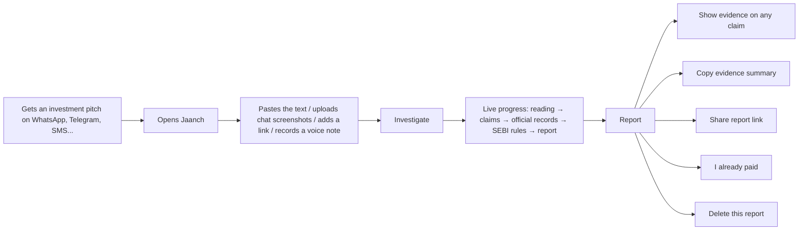

# User workflows

Jaanch is a website. It works on any phone or computer browser, in English and Hindi, with no
account and no app to install (it can be installed as a web app).

## 1. Check a message

**Getting the pitch into Jaanch.** Copy the message text and paste it, or take screenshots of the
chat (up to 5) and upload them; links and voice notes work too. On Android, the installed web app
appears in the share sheet for text and links. Screenshots are compressed in the browser before
upload, which keeps data use low on slow connections.

**While it checks** (usually under a minute), the page shows each stage: reading the message,
finding claims, checking official records, applying SEBI's rules, writing the report. The report
link can be bookmarked or shared; it works for 7 days.

**Report layout:**

1. Headline (a summary of the claim verdicts, never an overall rating) and dates.
2. Tally of verdicts.
3. _In short_: only when a model-written summary passed the safety guard.
4. _What the message claims_: one entry per claim: stamp, the claim in plain words, the exact
   quote from the message, the explanation, caveats, and _Show evidence_ (official record fields,
   rule citations, links, as-of dates).
5. _Who is contacting you, and who is registered_: the channel-binding table.
6. _Warning signs_: by severity.
7. _Could not check_: always present when something wasn't checkable.
8. _What to do next_: numbered, with official links and tap-to-call numbers.
9. _What we read from your message_ and _Sources checked for this report_ (collapsed).

The language switch (top right) re-renders the same report in Hindi or English.

**Samples.** The home page offers three clearly labelled sample messages (a fake adviser, a crypto
doubling pitch, a genuine SIP reminder) so anyone can see how Jaanch behaves; samples are checked
against the same live sources.

## 2. "I already paid"

Reachable from every report (**I already paid** button). It is routing, not a complaint
portal, and collects nothing:

1. Call **1930** (national helpline for reporting financial fraud). Tap to call.
2. File at **cybercrime.gov.in**; report the numbers, UPI IDs and links used.
3. Tell your **bank** through the number on your card or passbook or the official app.
4. Raise a **fraudulent transaction** complaint in your UPI app or on NPCI's UPI Help.
5. **Keep evidence**: screenshots, transaction ID (UTR), numbers, UPI IDs, links.
6. _(Only if the message really came from a registered firm)_ complain to the firm, then on
   **SEBI SCORES**.
7. Beware of anyone offering to recover the money for a fee.
8. **Copy the evidence summary** (report id, timestamps, each claim with the official record,
   identifiers from the message, sources and as-of dates) and attach it to the complaint.

## 3. A legitimate message

A genuine message is not flagged for using financial words. A mutual-fund SIP reminder with the
standard "subject to market risks" disclaimer produces no claims and no warnings. A message from a
registered firm that uses its registered name, its number and its official email domain produces
**MATCHES** for the registration and **MATCHES** for the contact details, with the caveat that
details can be copied, and the could-not-check list still shown.

## 4. When something is unclear

- Blurry number in a screenshot → **CAN'T CHECK**, "check the number in the original message";
  if one plausible reading exists in the register, it is offered as a possibility.
- Model or source unavailable → the report says which, and nothing is inferred from silence.
- Voice note when speech-to-text isn't configured → "voice notes can't be checked yet".
